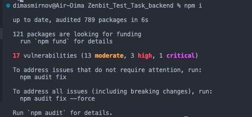
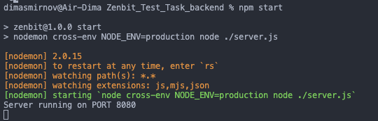

This backend is written in Node.js and uses a MySQL database.

To start the server, simply fork this repository or download it locally to your computer. Run the 'npm install' command, and after it's completed, execute the following command in the terminal: 'npm start'. This will start the server. Afterward, you'll be able to perform all the necessary interactions with the backend through the website's frontend. This database provides registration and login functionality for users, as well as the ability to log out.

