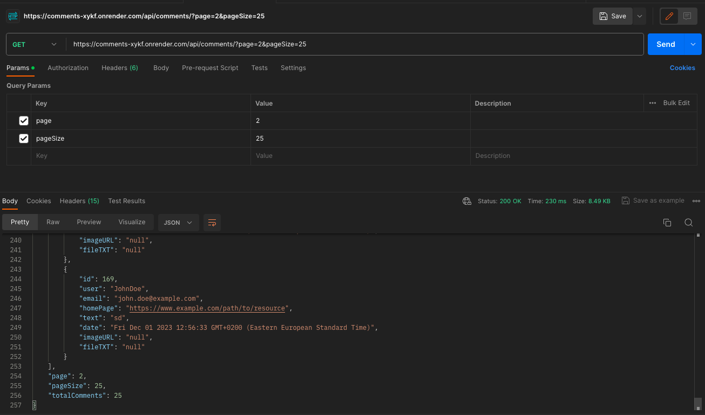
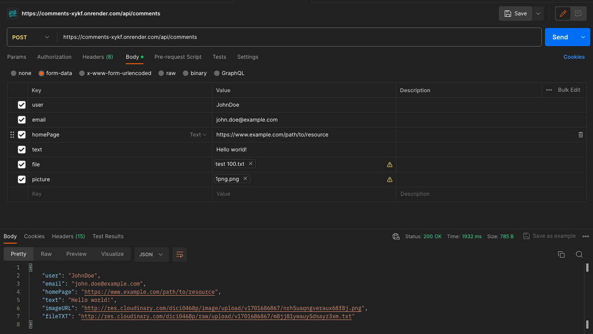
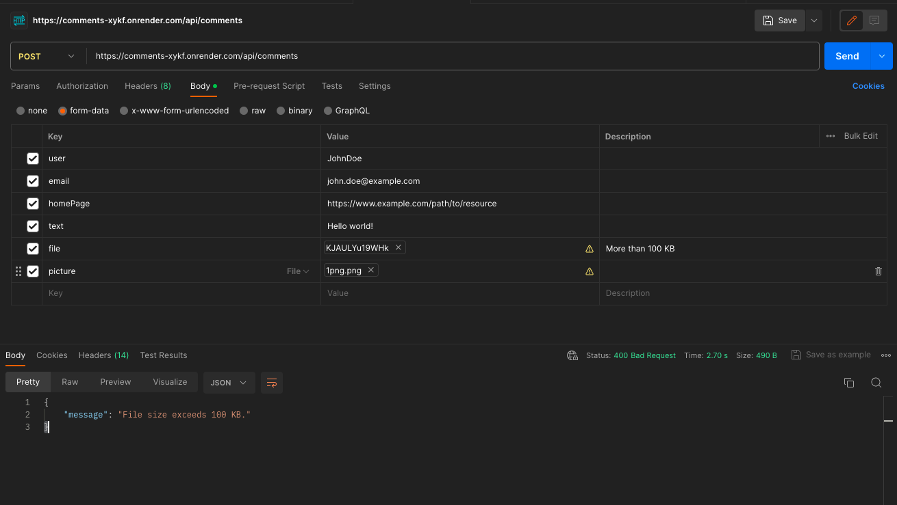

This backend allows making GET requests, including requests for paginating pages and specifying the amount of information displayed per page. Additionally, a POST request is available for adding a new comment from a user.
An event handler and user token generation were also added when posting a comment.

The database used is **`MySQL`**.

To run the server locally, you need to download this repository, install all dependencies using the terminal command **`npm i`**, and start the server with the command **`npm start`**.

The second option involves working with the server via the link **`https://comments-xykf.onrender.com`** because it is hosted on Render.com and is continuously active.

Making a **`GET`** request with **`parameters`** to the backend will return the number of comments on the specified page, as well as additional information (screenshot below).

In the screenshot, you can see a visual example of a **`POST`** request, showing what is included in the request and what is returned.

A text file or/and image is not required.
If a text file **`exceeds 100 KB`** in size, an error will be thrown with an explanation.

According to the requirements, the image should be in a limited format (JPG, GIF, PNG) and will be proportionally resized if the uploaded size exceeds 320x240 pixels.

## Localhost

GET request to retrieve all comments:
http://localhost:8080/api/comments

GET request to retrieve all comments with parameters:
http://localhost:8080/api/comments/?page=1&pageSize=25

POST request to add a comment:
http://localhost:8080/api/comments

## Hosting

GET request to retrieve all comments:
https://comments-xykf.onrender.com/api/comments

GET request to retrieve all comments with parameters:
https://comments-xykf.onrender.com/api/comments/?page=1&pageSize=25

POST request to add a comment:
https://comments-xykf.onrender.com/api/comments
